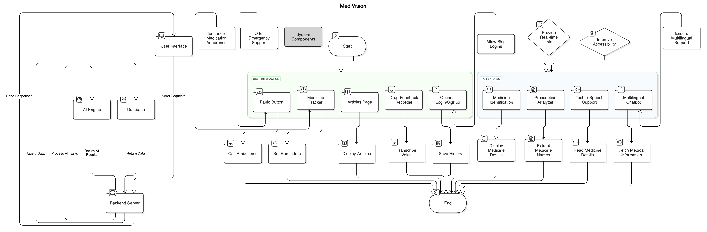

# MediVision

## 1. Abstract
MediVision is an AI-powered healthcare assistant designed to enhance accessibility and convenience in medicine recognition, tracking, and information retrieval. By leveraging image recognition, text-to-speech, multilingual chatbots, and web scraping, MediVision empowers users with disabilities, healthcare professionals, and patients by providing accurate medicine details and reminders.

## 2. Motivation
The complexity of modern healthcare presents significant challenges, especially for individuals who struggle with language barriers, visual impairments, or the ability to track their medications effectively. Misuse of medication, forgetting dosages, and difficulty in understanding prescriptions can lead to severe health complications. MediVision is designed to eliminate these issues by providing an accessible, user-friendly solution that requires no mandatory login, ensuring that anyone can access critical healthcare assistance instantly.

## 3. Problem Statement
Many patients, particularly those with disabilities or elderly individuals, face challenges in correctly identifying medicines, understanding their usage, and managing prescriptions. Existing healthcare applications often require cumbersome sign-up processes, limiting immediate access to essential features. Additionally, emergency situations require swift response systems that most healthcare applications do not provide. The lack of an all-in-one AI-powered healthcare assistant leads to inefficiencies in medication management and information retrieval.

## 4. Proposed Solution
MediVision aims to provide an all-encompassing solution by offering:
- AI-driven medicine identification through image recognition
- Text-to-speech support to assist visually impaired individuals
- A multilingual chatbot that can interactively fetch medical information
- A medicine tracking system with reminders based on meal schedules
- A prescription analyzer for easy extraction of medicine names
- Optional login/signup for saving browsing history and personalized reminders

## 5. Objectives
- Improve accessibility for visually impaired individuals
- Provide instant, real-time, and accurate medicine information
- Ensure multilingual support for diverse users
- Enhance medication adherence through structured reminders
- Allow users to skip logins while enabling history tracking for registered users

## 6. Features
1. **Medicine Identification** – Upload a medicine photo to get details like name, dosage, uses, side effects, and a summary.
2. **Text-to-Speech Support** – Reads out medicine details in English with an option to mute.
3. **Multilingual Chatbot** – Provides interactive medical assistance using web scraping.
4. **Medicine Tracker** – Sets reminders for medication intake based on timing and meals.
5. **Prescription Analyzer** – Extracts medicine names from uploaded prescriptions.
6. **No Mandatory Login** – Users can skip signing up but will have limited features; registered users can track history and reminders.

## 7. Architecture Diagram


## 8. Tech Stack
- **Frontend:** HTML, CSS, Javascript
- **Backend:** Flask, Python
- **Database:** Firebase
- **AI/ML:** TensorFlow, OpenCV, Speech-to-Text API, Streamlit

## 9. Screenshots


## 10. Challenges Faced
- Ensuring AI-driven medicine identification is accurate
- Optimizing multilingual chatbot functionality with real-time web scraping
- Implementing efficient text-to-speech features
- Managing an intuitive medicine tracking system with customizable reminders
- Extracting medicine names from handwritten prescriptions accurately

## 11. Future Scope
- Expand text-to-speech support to multiple languages
- Convert MediVision into a fully functional mobile application
- Integrate blockchain for secure storage of medical records
- Enhance chatbot AI to provide diagnostic suggestions
- Smartwatch and wearable device integration for seamless reminders

## 12. How to Run
```bash
# Clone the repository
git clone https://github.com/yourusername/MediVision.git

# Install dependencies
pip install -r requirements.txt
npm install  # For frontend

# Run backend
uvicorn main:app --reload

# Run frontend
npm start
```

## 13. Team Members
| **Prajwala Yadlapalli** | **Naidu Yaswanth Reddy** | **M S Akhila** | **Muriki Teja** |
|-------------------------|--------------------------|----------------|---------------|

---

MediVision is a step toward making healthcare more accessible, inclusive, and efficient. By eliminating mandatory login barriers while providing value-added features for registered users, we ensure that anyone in need can access medical assistance instantly. In the future, we aim to expand MediVision into a mobile application to enhance its reach and usability.

